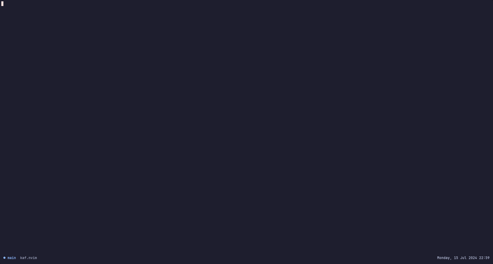

## Kaf.nvim

A plugin for manager kafka topics and messages



**This is an alpha software. Expect Breaking Changes!**

## Getting Started

[Neovim 0.9](https://github.com/neovim/neovim/releases/tag/v0.9.5) or higher is required for `kaf.nvim` to work.

### Dependencies

- [plenary.nvim](https://github.com/nvim-lua/plenary.nvim)
- [telescope.nvim](https://github.com/nvim-telescope/telescope.nvim)
- [fidget.nvim](https://github.com/j-hui/fidget.nvim) (Optional)

### Installation

- Using [lazy.nvim](https://github.com/folke/lazy.nvim)

```lua
return {
    'kessejones/kaf.nvim',
    dependencies = {
        "nvim-lua/plenary.nvim",
        "nvim-telescope/telescope.nvim",
        "j-hui/fidget.nvim", -- optional
    },
}

```

### Usage

#### Options

```lua
require('kaf').setup({
    integrations = {
        fidget = true,
    },
    confirm_on_produce_message = true,
})
```

#### Mappings

| Mappings | Prompt   | Action                                            |
| -------- | -------- | ------------------------------------------------- |
| `<CR>`   | Clients  | Set selected client as default                    |
| `<C-n>`  | Clients  | Create a new client                               |
| `<C-x>`  | Clients  | Remove selected client                            |
| `<CR>`   | Topics   | Set selected topic as default                     |
| `<C-n>`  | Topics   | Create a new topic in this client                 |
| `<C-x>`  | Topics   | Delete selected topic                             |
| `<CR>`   | Messages | Open the selected message value into a new buffer |

#### Example

You can configure your key mappings like this example.

```lua
local kaf_telescope = require("kaf.integrations.telescope")

vim.keymap.set('n', '<Leader>ee', function() kaf_telescope.clients() end, { desc = "List clients entries" })

vim.keymap.set('n', '<Leader>et', function() kaf_telescope.topics() end, { desc = "List topics from selected client" })

vim.keymap.set('n', '<Leader>em', function() kaf_telescope.messages() end, { desc = "List messages from seleted topic and client" })

vim.keymap.set('n', '<Leader>ep', function()
    require('kaf.api').produce({ value_from_buffer = true, })
end, { desc = "Produce a message into selected topic and client" })

```

### Extras

See the [API documentation](./doc/api.md) for more details

## Contributing

All contributions are welcome! Just open a pull request.

Please look at the Issues page to see the current backlog, suggestions, and bugs to work.
